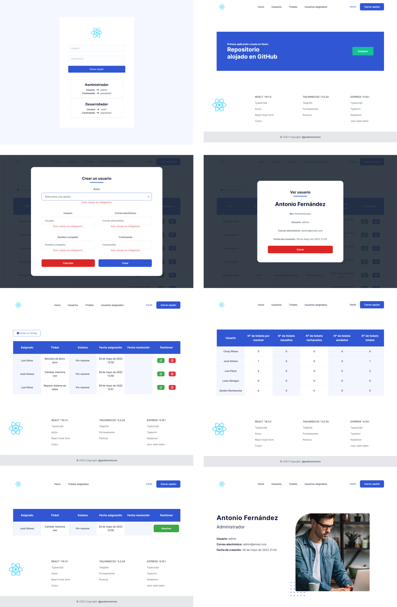

# Support project frontend

### Used technology:

- [React](https://reactjs.org/)
- [TypeScript](https://www.typescriptlang.org/)
- [Tailwindcss](https://tailwindcss.com/)
- [Tailgrids](https://tailgrids.com/)
- [Axios](https://axios-http.com/)
- [Craco](https://www.gsoft.com/en/)
- [React Hook Form](https://react-hook-form.com/)

## Requirements

- [Node.js](https://nodejs.org/) v16 or newer, [NPM](https://www.npmjs.com/) package manager

## Getting Started

1. Clone repository
```
$ git clone https://github.com/pedroriverove/support-project-front.git
```
2. Change into the working directory
```
$ cd support-project-front
```
3. Copy `.env.example` to `.env` and modify according to your environment
```
$ cp .env.example .env
```
4. Install project dependencies
```
$ npm install
```
5. Finally, launch the app
```
$ npm start
```

## Scripts

- `npm start` — Launches the app in development mode on [`http://localhost:3000`](http://localhost:3000/)
- `npm build` — Compiles and bundles the app for deployment

## Related Projects

- [Support Project Back](https://github.com/pedroriverove/support-project-back) — project template, pre-configured with Express and Typescript

## Admin Credentials

- `username` — admin
- `password` — password

## Dev Credentials

- `username` — user1
- `password` — password

## Screenshot


